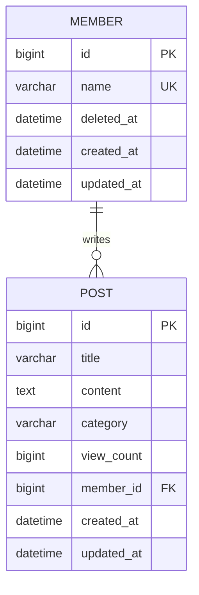

# 게시판 ERD

```mermaid
erDiagram
    MEMBER ||--o{ POST : writes
    MEMBER {
        bigint id PK
        varchar name UK
        datetime deleted_at
        datetime created_at
        datetime updated_at
    }
    POST {
        bigint id PK
        varchar title
        text content
        varchar category
        bigint view_count
        bigint member_id FK
        datetime created_at
        datetime updated_at
    }
```

`POST.member_id`는 필수 외래 키이며, 모든 게시글은 하나의 회원을 작성자로 참조합니다.
